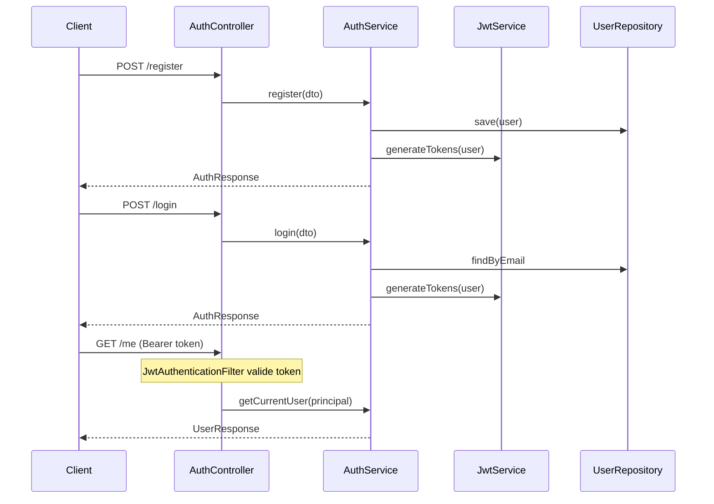

# Plan : Authentification et migrations Flyway

## Contexte

Le backend Spring Boot utilise déjà Spring Security, BCryptPasswordEncoder et une configuration stateless. Le frontend attend une **AuthResponse** avec `token`, `refreshToken` et `user`, et envoie un Bearer token pour les requêtes protégées. L'OpenAPI est déjà configuré pour JWT.

**Champs du formulaire d'inscription** : `firstName`, `lastName`, `email`, `phone` (optionnel), `password`, `role` (CUSTOMER ou RESTAURANT_OWNER)

---

## 1. Authentification par JWT

**Méthode choisie** : JWT (access + refresh token) avec la librairie **JJWT** (io.jsonwebtoken).

- **Access token** : courte durée (~15 min) pour authentifier les requêtes
- **Refresh token** : stocké en base (entity `RefreshToken`) pour permettre la révocation au logout

**Composants à créer** :

- `JwtService` : génération/validation des tokens, extraction du subject (userId)
- `JwtAuthenticationFilter` : filtre Spring Security qui valide le Bearer token et remplit le `SecurityContext`
- `RefreshToken` entity + repository pour stocker et invalider les refresh tokens

---

## 2. Entité User et DTOs

**User** (aligné sur le formulaire et le type frontend) :

| Champ     | Type                                     | Obligatoire  |
| --------- | ---------------------------------------- | ------------ |
| id        | UUID                                     | auto         |
| email     | String                                   | oui (unique) |
| password  | String (hashé)                           | oui          |
| firstName | String                                   | oui          |
| lastName  | String                                   | oui          |
| phone     | String                                   | non          |
| role      | Enum (CUSTOMER, RESTAURANT_OWNER, ADMIN) | oui          |
| createdAt | LocalDateTime                            | auto         |
| updatedAt | LocalDateTime                            | auto         |

**DTOs** :

- `LoginRequest` (email, password)
- `RegisterRequest` (firstName, lastName, email, phone?, password, role?)
- `AuthResponse` (token, refreshToken, user)
- `UserResponse` (id, email, firstName, lastName, phone?, role, createdAt, updatedAt)

---

## 3. Endpoints REST

| Méthode | Path                 | Accès       | Description                            |
| ------- | -------------------- | ----------- | -------------------------------------- |
| POST    | `/api/auth/register` | Public      | Inscription                            |
| POST    | `/api/auth/login`    | Public      | Connexion                              |
| GET     | `/api/auth/me`       | Authentifié | Infos du compte connecté               |
| POST    | `/api/auth/logout`   | Authentifié | Invalidation du refresh token          |
| POST    | `/api/auth/refresh`  | Public      | Nouveau access token via refresh token |

**Contrôleur** : `backend/src/main/java/com/deipna/controller/AuthController.java` (à créer)

---

## 4. Configuration Flyway

**Modifications** :

- Ajout de la dépendance `flyway-core` dans [pom.xml](backend/pom.xml)
- `spring.jpa.hibernate.ddl-auto: validate` (pour éviter que Hibernate crée les tables)
- `spring.flyway.enabled: true` (valeur par défaut)
- Répertoire des migrations : `src/main/resources/db/migration/`

**Convention de nommage** : `V0_XXX__description.sql` où XXX est le numéro de version (ex. 001, 002...)

**Fichiers de migration** :

- `V0_001__initial_schema.sql` : contient toutes les initialisations de tables au démarrage
  - Table `users` : id (UUID), email (unique), password, first_name, last_name, phone, role, created_at, updated_at
  - Table `refresh_tokens` : id (UUID), token, user_id (FK), expires_at, revoked (boolean)
- `V0_002__add_revoked_access_tokens.sql` : table `revoked_access_tokens` pour la blacklist au logout (jti, expires_at)

---

## 5. Modifications de la configuration

**SecurityConfig** :

- Ajouter `JwtAuthenticationFilter` dans la chaîne de filtres (avant `UsernamePasswordAuthenticationFilter`)
- Garder `/api/auth/login`, `/api/auth/register`, `/api/auth/refresh` en `permitAll()`
- `/api/auth/me` et `/api/auth/logout` protégés par authentification

**application.yml** : ajout des propriétés JWT (secret, durée access/refresh token) via des variables d'environnement ou configuration externe.

---

## 6. Gestion des erreurs

- Gérer `DataIntegrityViolationException` (email déjà utilisé) dans `GlobalExceptionHandler` pour renvoyer un message explicite lors de l'inscription.
- `BadCredentialsException` est déjà géré pour le login.

---

## 7. Tests

- Tests d'intégration pour : register, login, /me (authentifié), logout, refresh.
- Base existante : `BaseIntegrationTest` + TestContainers.

---

## 8. Schéma de flux

---

## Fichiers principaux à créer/modifier

**Créer** :

- `entity/User.java`, `entity/RefreshToken.java`
- `entity/UserRole.java` (enum)
- `repository/UserRepository.java`, `repository/RefreshTokenRepository.java`
- `dto/auth/LoginRequest.java`, `RegisterRequest.java`, `AuthResponse.java`, `UserResponse.java`, `RefreshTokenRequest.java`
- `service/AuthService.java`, `service/JwtService.java`
- `controller/AuthController.java`
- `config/JwtAuthenticationFilter.java`
- `db/migration/V0_001__initial_schema.sql`
- `db/migration/V0_002__add_revoked_access_tokens.sql` (blacklist pour logout)

**Modifier** :

- [pom.xml](backend/pom.xml) : dépendances Flyway + JJWT
- [SecurityConfig.java](backend/src/main/java/com/deipna/config/SecurityConfig.java) : `JwtAuthenticationFilter`
- [application.yml](backend/src/main/resources/application.yml) : config Flyway + JWT
- [application-dev.yml](backend/src/main/resources/application-dev.yml) : `ddl-auto: validate` (dev aligné avec prod pour Flyway)
- [GlobalExceptionHandler.java](backend/src/main/java/com/deipna/exception/GlobalExceptionHandler.java) : gestion email dupliqué
